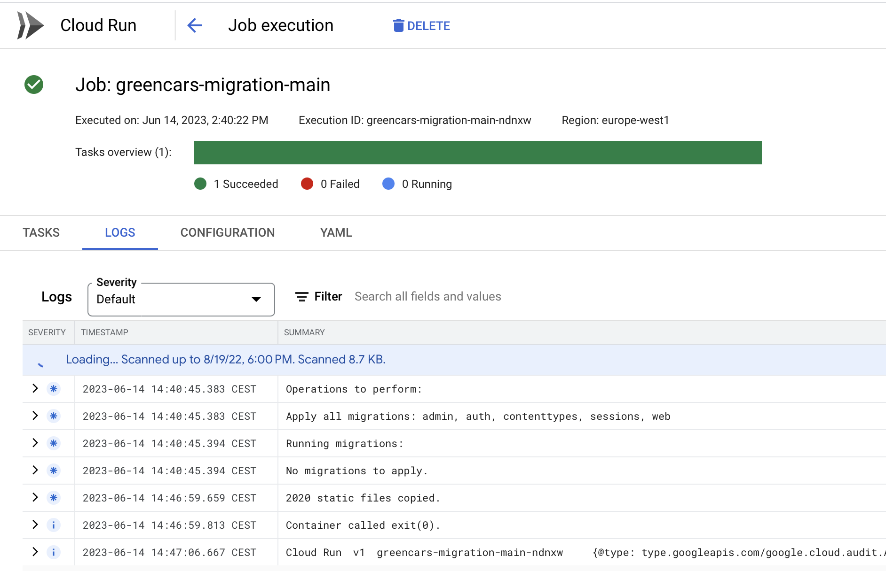
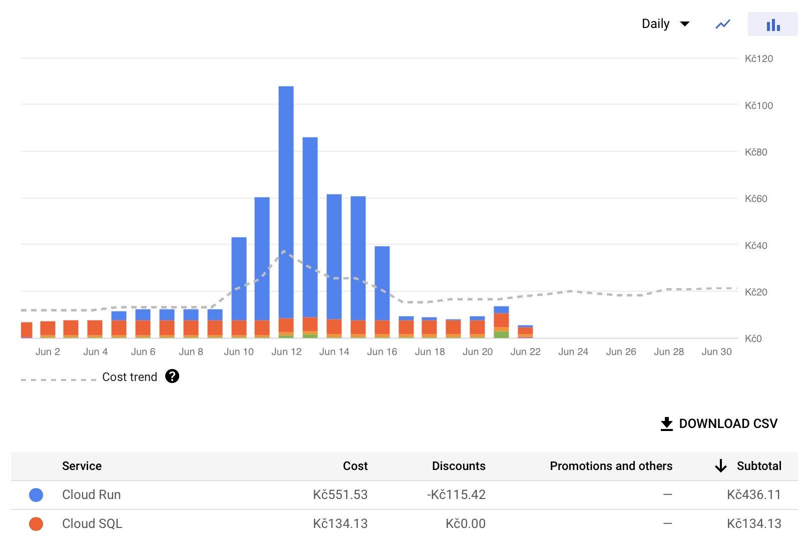
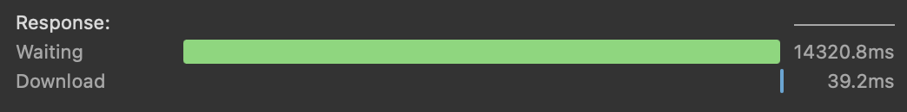
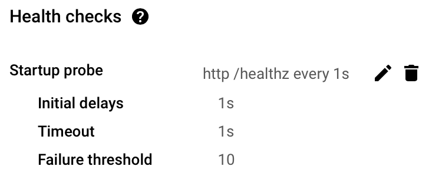
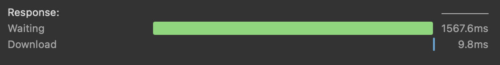

# Django on Google Cloud Run

I am particularly fond of Google Cloud Run, but there is limited information available on running Django applications on this service. In this article, I aim to share my experiences and insights gained from deploying Django on Cloud Run.

## Migrations

During the migration process, it necessary to execute a series of commands, which collectively took several minutes to complete:

```
./manage.py collectstatic
./manage.py migrate
```

To streamline this process, I created a [migrate.sh](https://github.com/pavelkraleu/greenhack-cars/blob/main/migrate.sh) script that runs these commands within the Docker container. This Docker container is the same one used to handle web requests on Cloud Run.

I incorporated this script into the [Github Actions CI/CD pipeline](https://github.com/pavelkraleu/greenhack-cars/blob/main/.github/workflows/build_test_deploy.yaml#L51) for execution. The deployment process proceeds only if the migrations are successful.



## Cost Optimization

During my usage of Cloud Run, I encountered unexpectedly high costs associated with running instances. To address this issue, I implemented a strategy to scale Cloud Run to zero instances and start only when necessary.



However, I observed that the response time during the scaling process, especially when transitioning from zero running instances, was uncharacteristically high.



To optimize the response time during cold starts, I discovered that configuring health checks to run more frequently proved to be effective.



By implementing this approach, the waiting time for instances to become active significantly decreased.

